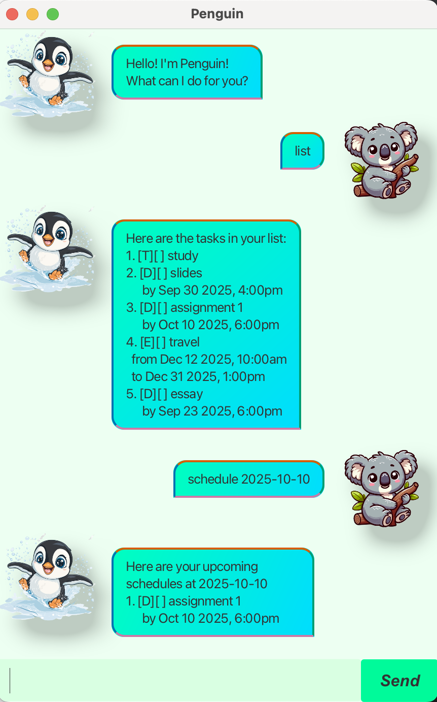

# Penguin User Guide 
### Your friendly task-tracking chatbot.

## Product Screenshot
 

##  Introduction

Penguin is a simple yet powerful chatbot that helps you to **manage tasks**.  
You can add **Todos, Deadlines, and Events**, then **list, mark, unmark, delete, find, and schedule** them.  
Finally, type `bye` to exit the chatbot.

## Quick Reference

| Command   | Format                                                            | Example                                                         |
|-----------|-------------------------------------------------------------------|-----------------------------------------------------------------|
| **Todo**  | `todo <description>`                                              | `todo study for exam`                                           |
| **Deadline** | `deadline <description> by <dd/MM/yyyy HHmm>`                     | `deadline assignment 1 by 2025/10/10 1800`                      |
| **Event** | `event <description> from <dd/MM/yyyy HHmm> to <dd/MM/yyyy HHmm>` | `event project meeting from 2025/09/20 1400 to 2025/09/20 1600` |
| **List**  | `list`                                                            | `list`                                                          |
| **Mark**  | `mark <task number>`                                              | `mark 2`                                                        |
| **Unmark** | `unmark <task number>`                                            | `unmark 2`                                                      |
| **Delete** | `delete <task number>`                                            | `delete 1`                                                      |
| **Find**  | `find <keyword>`                                                  | `find meeting`                                                  |
| **Schedule** | `schedule` or    `schedule [yyyy-MM-dd]`                          | `schedule` or  `schedule 2025-09-20`                            |
| **Exit**  | `bye`                                                             | `bye`                                                           |

##  Features

### 1. Adding Todos
Adds a simple task without any date/time.

**Usage**  
todo

**Example Input**    
`todo study from exam`  

**Expected Output**    
> OK! I’ve added this task:   \
[T][ ] study for exam \
Now you have 1 task in the list.

### 2. Adding Deadlines

Adds a task with a due date/time.

**Usage**  
deadline <description> by <dd/MM/yyyy HHmm>

**Example Input**  
`deadline assignment 1 by 2025/10/10 1800`

**Example Output**  
> OK! I’ve added this task: \
[D][ ] assignment 1 by Oct 10 2025, 6:00pm\
Now you have 2 tasks in the list.

### 3. Adding Events

Adds a task with a start and end time.

**Usage**  
event < description> from <dd/MM/yyyy HHmm> to <dd/MM/yyyy HHmm>

**Example Input**  
`event project meeting from 2025/09/20 1400 to 2025/09/20 1600`

**Expected Output**  
>OK! I’ve added this task: \
> [E][ ] project meeting from Sep 20 2025, 2:00pm to Sep 20 2025, 4:00pm)\
Now you have 3 tasks in the list.

### 4. Listing Tasks

Displays all tasks currently in your task list.

**Usage**
list

**Example Input**  
`list`

**Expected Output**
>Here are the tasks in your list: 
> 1.	[T][ ] study for exam
> 2.	[D][ ] assignment 1 \
>       by Oct 10 2025, 6:00pm
> 3.	[E][ ] project meeting \
>  from Sep 20 2025, 2:00pm \
> to Sep 20 2025, 4:00pm
>

### 5. Marking Tasks

Marks a task as **completed**.

**Usage**  
mark < task number> 

**Example Input**  
`mark 2`

**Expected Output**
>Nice! I’ve marked this task as done:\
[D][X] assignment 1 \
> by Oct 10 2025, 6:00pm

### 6. Unmarking Tasks

Sets a completed task back to **incomplete**.

**Usage**
unmark < task number> 

**Example Input**  
`unmark 2`

**Expected Output**
>OK! I've unmarked this task:\
[D][] assignment 1 \
> by Oct 10 2025, 6:00pm

### 7. Deleting Tasks

Removes a task from the task list.

**Usage**
delete < task number> 

**Example Input**  
`delete 1`

**Expected Output**
>OK! I’ve removed this task: \
[T][ ] study for exam\
Now you have 2 tasks in the list.

### 8. Finding Tasks

Searches for tasks containing a specific keyword.

**Usage**
find < task number> 

**Example Input**  
`find meeting`

**Expected Output**
>Here are the matching results in your list:
>3. [E][ ] project meeting \
>from Sep 20 2025, 2:00pm \
>to Sep 20 2025, 4:00pm
>
### 9. Viewing Schedules
Shows upcoming scheduled tasks. If no date is specified, returns all upcoming schedules.

**Usage**
schedule or schedule < YYYY/MM/DD>

**Example Input 1**  
`schedule`

**Expected Output**
>Here are your upcoming schedules:
> 1.	[D][ ] assignment 1 by Oct 10 2025, 6:00pm
> 2.	[E][ ] project meeting from Sep 20 2025, 2:00pm to Sep 20 2025, 4:00pm

**Example Input 2**  
`schedule 2025/09/20`

**Expected Output**
>Here are your upcoming schedules at 2025/09/20:
> 1. [E][ ] project meeting from Sep 20 2025, 2:00pm to Sep 20 2025, 4:00pm
>
### 10. Exiting Penguin

Closes the chatbot.

**Usage**  
bye

**Expected Output**  
Byebye! Hope to see you again!